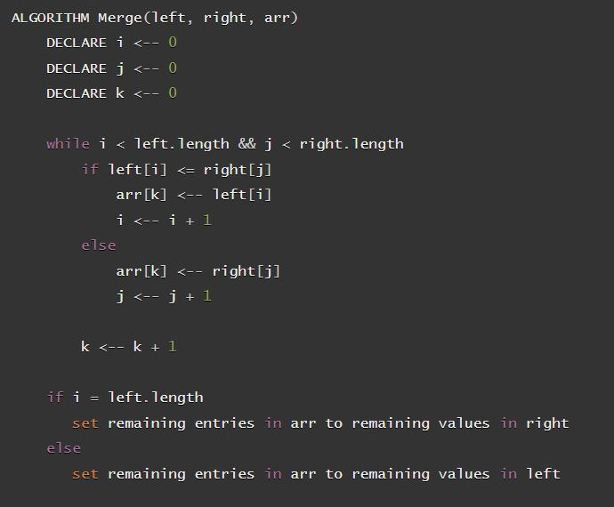
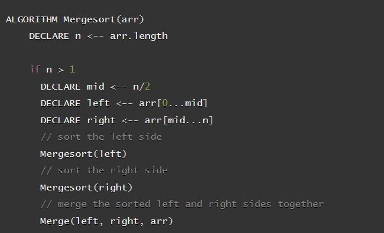

# Insertion Sort

## Overview

In this blog post we are going to be exploring merge sort. Merge sort is a sorting algorithm that works by first splitting up an array into arrays with only once value, then comparing those arrays together and merging them back together.


## Pseudo Code
Here is the pseudo code we will be walking through:
<br>
### 1.



<br>

### 2.


## Trace

To begin, we will start with this sample array:

> ```[8,4,23,42,16,15]```

### Layout of 1. merge()

- our merge function will take as parameters: left, right, and arr
- We will begin by declaring three variables, i j, k
- Next we will create a while loop which will run while i is less than left.length and j is less than right.length
  - we will then check if the value at the left at position i is less than or equal to the value at position j in the right array
    - if true, we will place the value from the left array into the arr array at position k, and increment i by 1
    - else, we will place the value from the right array into the arr array at position k, and increment j by 1
  - we will then increment k by one
- Once we have broken out of the loop:
- we will check if i is equal to the length of the left array
  - if so we will fill the arr array with the remaining values from the right array.
  - else we will fill the arr array with the remaining values from the left array.

### Layout of 2. mergeSort()

- our mergeSort function will take as parameters: arr
- First we will set the variable n to the length of the array
- next, we will check if n is greater than one and execute the following indented code if so:
  - first we will get the mid value by dividing n by 2, we will set this to a variable called mid.
  - next we will create a left array variable and set it equal to the left half of the passed in array
  - then we will create a right array variable and set it equal to the right half of the passed in array
  - we will then call mergesort on the left array, then we will call it on the right array.
  - afterwards, we will call merge on the left, right, and the passed in array.

## Execution:

- The mergeSort function is called recursively on the left and right arrays until they are split down to individual values. Once the individual values are reached, merge is called and the values are compared and merged together, each time returning at larger array until the entire array is merged back together.