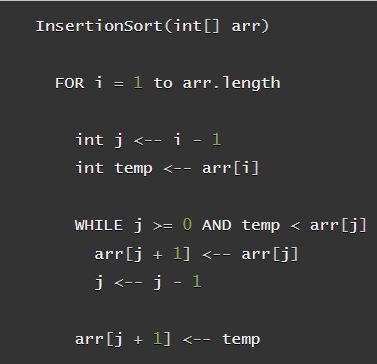
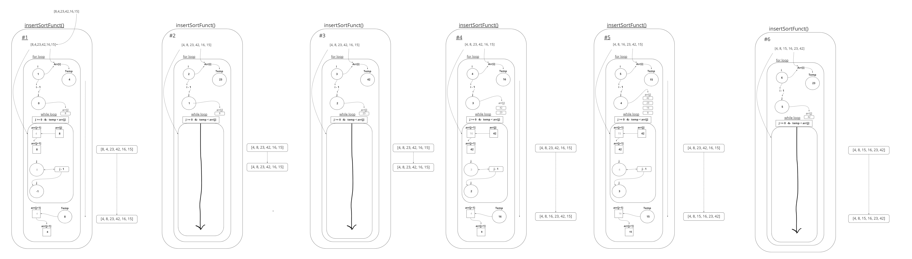

# Insertion Sort

## Overview

In this blog post we are going to be exploring insertion sort. Insertion sort os a sorting algorithm that works by splitting your list, in our case, an array into ordered and unordered parts. In insertion sort, values are take from the unsorted part and placed into the sorted part.

## Pseudo Code
Here is the pseudo code we will be walking through:
<br>


## Trace

To begin, we will start with this sample array:

> ```[8,4,23,42,16,15]```

### InsertSortFunct() Layout

- Our insertion sort function will take as an argument an array of integers, and will modify that array in place using two temp variables.

- We will begin our function by setting up a for loop that will run from 1 until the last index of the array, tracking it's iteration with an integer variable we will call "i".

- The rest of the steps will take place within the for loop,

- We will define an integer variable named "j" and set it equal to "i" minus 1.

- We will then define another integer variable names "temp" and set it equal to the array at the position represented by the variable "i".

- Next we will define a while loop, checking two conditions:
  - First, checking that the value held in the "j" variable is greater than or equal to zero.
  - Second, checking that the value held in the temp variable is less than the value held in the array at the "j"th position.

    <br>
    - While the above conditions are true, the will loop will run. Each time through the loop it will:
      - First, replace the value held in the array at the position `j + 1` with the value held in the array at the position `j`
      - Second, it will set the value of `j` to the value of `j - 1`
    <br>

  - If the while loop does not evaluate to true on some iteration, the computer will exit the loop
  - Finally, and remember, we are still within the for loop.
  - The value at the position `j = 1` will be set to the value held within the temp variable.

### Insertion Sort Steps Visualized

