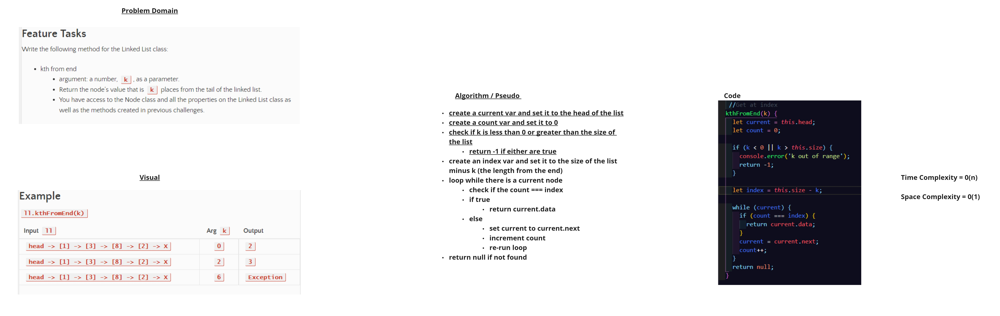

# Challenge Summary

## linked-list-kth
<!-- Description of the challenge -->
k-th value from the end of a linked list.

## Whiteboard Process
<!-- Embedded whiteboard image -->

## Approach & Efficiency
<!-- What approach did you take? Why? What is the Big O space/time for this approach? -->
Each solution uses a single while loop to move through the list, checking against a condition

the Space complexity is O(n) and the time complexity is O(1)

## Solution
<!-- Show how to run your code, and examples of it in action -->

## Usage

To test code run: `npm test`